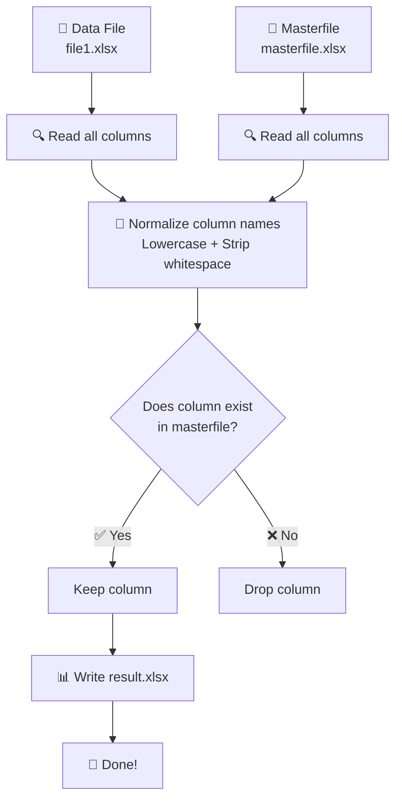

<div align="center">

# 🧹 Excel Column Filter

### *Tame the chaos. Keep only what matters.*


</div>

---

## 📌 Project Name & Purpose

**Project:** `filter_column.py`

**Ever received an Excel file drowning in unnecessary columns?** This is a lightweight Python command-line tool that takes your messy, column-heavy Excel file and a clean masterfile, compares the two, and produces a **brand new Excel file containing only the columns that matter** — with all their original data intact.

No manual copy-pasting. No accidentally deleting the wrong column. Just one command and it's done. ✅

---

## 🗺️ Overview

| | |
|---|---|
| 🐍 **Language** | Python 3.8+ |
| 📦 **Dependencies** | `pandas`, `openpyxl` |
| 💻 **Platform** | Windows, macOS, Linux |
| 🖥️ **Interface** | Command-line |
| 📥 **Input** | Two `.xlsx` Excel files |
| 📤 **Output** | One filtered `.xlsx` Excel file |
| 🔡 **Matching** | Case-insensitive, whitespace-tolerant |
| ⏱️ **Setup time** | ~5 minutes |


---

## 🤔 What Does It Do?

**Think of it as a bouncer for your Excel columns.** You hand it two files:

- 📋 **Your data file** — the messy, column-heavy Excel file you received
- 📌 **Your masterfile** — the single source of truth defining which columns *actually* matter

It reads both, compares them intelligently, and spits out a **brand new, clean Excel file** with only the approved columns — data intact.

---

## ✨ How It Works



---

## ⚡ Quick Start

### 🛠️ Prerequisites

Before you begin, make sure you have the following installed:

- **Python 3.8 or above**
  Check by running:
  ```bash
  # macOS / Linux
  python3 --version

  # Windows
  python --version
  ```
  > 🔎 **Not sure which command to use?** Run both — whichever returns `Python 3.x.x` (not 2.x) is the one to use for all commands going forward.

  👉 Don't have Python? Download it from [python.org](https://www.python.org/downloads/)

- **pip** (Python's package installer — usually comes bundled with Python)
  Check by running:
  ```bash
  # macOS / Linux
  pip3 --version

  # Windows
  pip --version
  ```

- **Git**
  Check by running:
  ```bash
  git --version
  ```
  👉 Don't have Git? Download it from [git-scm.com](https://git-scm.com/downloads)

---

## 🚀 Installation

### Step 1 — Clone the repository

```bash
git clone https://github.com/ayush7-hash/project1.git
```


> ⚠️ **GitHub no longer accepts plain passwords for git operations.**
> You'll need a **Personal Access Token (PAT)** instead. Here's how to set one up:

---

### 🔑 Setting Up Authentication (HTTPS + Personal Access Token)

**Step 1 —** Go to your GitHub profile picture → **Settings** → scroll to **Developer settings** (bottom of left sidebar) → **Personal access tokens** → **Tokens (classic)**


**Step 2 —** Click **"Generate new token (classic)"**, give it a name and expiry, and tick the **`repo`** scope ✅


**Step 3 —** Scroll down and Click **Generate token** and **copy it immediately** — GitHub shows it only once! 🚨

**Step 4 —** When you run `git clone`, enter your credentials like this:
```
Username for 'https://github.com': your-github-username
Password for 'https://your-github-username@github.com': paste-your-token-here
```
> 🔐 Use your **token** as the password — not your actual GitHub account password.

**Step 5 (Optional) —** Cache your token so you don't re-enter it every time:

| OS | Command |
|---|---|
| macOS | `git config --global credential.helper osxkeychain` |
| Windows | `git config --global credential.helper wincred` |
| Linux | `git config --global credential.helper store` |

---

### Step 2 — Install dependencies

```bash
# macOS / Linux
pip3 install -r requirements.txt

# Windows
pip install -r requirements.txt
```

> 📦 This installs both `pandas` and `openpyxl` in one shot — no need to install them separately.

---

## 🎯 Usage

```bash
cd project1

# macOS / Linux
python3 filter_column.py --data file1.xlsx --master masterfile.xlsx --output result.xlsx

# Windows
python filter_column.py --data file1.xlsx --master masterfile.xlsx --output result.xlsx
```


**Note:** The file names I have chosen in this screenshot(file1_sample.xlsx and masterfile_sample.xlxc) are my sample files , which are present in the project1 folder. Make sure you have your orignal data files in this project folder.
### 🎛️ All Available Options

| Argument | Required | Default | Description |
|---|---|---|---|
| `--data` | ✅ Yes | — | Path to the Excel data file you want to filter |
| `--master` | ✅ Yes | — | Path to the masterfile with approved column names |
| `--output` | ✅ Yes | — | Path to write the resulting filtered Excel file |
| `--data-sheet` | ❌ No | First sheet | Sheet name or index to read from the data file |
| `--master-sheet` | ❌ No | First sheet | Sheet name or index to read from the masterfile |
| `--case-sensitive` | ❌ No | Off | Turn on exact matching (case-sensitive, no trimming) |

---

## 🧠 The Smart Matching Engine

**This is where the real wizardry happens.** Column names in real-world Excel files are notoriously inconsistent — here's everything the normalizer handles automatically:

| Problem | Example (Data File) | Example (Masterfile) | Match? |
|---|---|---|---|
| Different casing | `VENDOR NAME` | `vendor name` | ✅ |
| Trailing spaces | `"Invoice Number "` | `"Invoice Number"` | ✅ |
| Leading spaces | `" Amount"` | `"Amount"` | ✅ |
| Double spaces | `"Sales  Region"` | `"Sales Region"` | ✅ |
| Non-breaking spaces | `"Vendor\xa0Name"` | `"Vendor Name"` | ✅ |
| Underscore vs space | `invoice_date` | `Invoice Date` | ❌ (structural difference) |

> 🔒 **Want exact matching instead?** Add the `--case-sensitive` flag and the normalizer steps aside completely.

---

## 📁 Sample Files

**Not sure where to start?** Two sample files are included in the `samples/` folder to let you test the script right away — no need to prepare your own files.

| File | Description |
|---|---|
| `samples/file1_sample.xlsx` | A data file with intentionally messy, inconsistently named headers |
| `samples/masterfile_sample.xlsx` | A clean masterfile with the approved column names |

**Try it yourself:**
```bash
# macOS / Linux
python3 filter_column.py --data samples/file1_sample.xlsx --master samples/masterfile_sample.xlsx --output result.xlsx

# Windows
python filter_column.py --data samples/file1_sample.xlsx --master samples/masterfile_sample.xlsx --output result.xlsx
```

**Expected output in your terminal:**
```
Done. 4 matching column(s) written to 'result.xlsx'.
Matched columns: ['VENDOR NAME ', ' Invoice Number', 'Amount (USD)', 'Sales  Region']
Columns in data file NOT found in masterfile (excluded): ['invoice_date', 'Internal Notes']
```


---

## 👥 Team Access — Adding Collaborators

**Authentication ≠ Authorization.** Setting up a PAT proves *who you are*. It doesn't automatically give you access to this repo.

**For each new team member:**

1. They set up their own PAT (steps above) — a one-time 5-minute task ⏱️
2. A repo admin goes to **Settings → Collaborators and teams → Add people** and adds their GitHub username with **Write** access

> ❗ If someone authenticates successfully but still gets a `403 — Write access not granted` error on push, step 2 hasn't been done for them yet. Contact a repo admin.

---

## ⚠️ Common Errors & Fixes

| Error | Cause | Fix |
|---|---|---|
| `command not found: python` | macOS/Linux uses `python3` | Use `python3` instead |
| `command not found: pip` | macOS/Linux uses `pip3` | Use `pip3` instead |
| `Missing optional dependency 'openpyxl'` | openpyxl not installed | Run `pip3 install -r requirements.txt` |
| `Authentication failed` | Using GitHub password instead of PAT | Generate a PAT and use that as the password |
| `403 Write access not granted` | Not added as a collaborator | Ask a repo admin to add you under Settings → Collaborators |
| `No matching columns found` | No column names in common between both files | Double-check column headers in both files |

---

## 📄 License

**MIT** — free to use, modify, and distribute. See [`LICENSE`](LICENSE) for full terms.

---

<div align="center">

**Built with 🐍 Python · 🐼 pandas **

*Got a question or found a bug? Open an issue — we don't bite.* 😄

</div>
